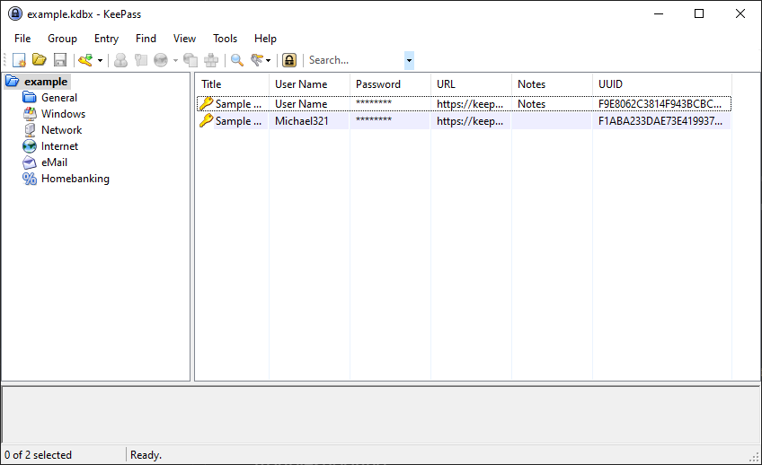

# Credentials

Type: `keepass-credentials`

The credentials data source is used to load credentials contained within a
password protected Keepass 2 file.

### Required

- `keepass_file` (string) - Path to the keepass 2 database.
- `keepass_password` (string) - Master password for the keepass 2 database.

### OutPut

- `map` (map[string]string) - A map of credentials. 

The following map keys are constructed for each entry within the keepass
database:

* `<uuid>-username`
* `<uuid>-password`
* `<uuid>-title`

To find the UUID of each credential entry, in Keepass go to **View** ->
**Configure Columns...** and check the **UUID** column to be displayed.



The example Keepass 2 database (`example/example.kdbx`) with sample entries will
thus generate the following keys and values:

```
F9E8062C3814F943BCBCB6FE81FAAA2F-username: User Name
F9E8062C3814F943BCBCB6FE81FAAA2F-password: Password
F9E8062C3814F943BCBCB6FE81FAAA2F-title: Sample Entry
F1ABA233DAE73E419937F475C593F31C-username: Michael321
F1ABA233DAE73E419937F475C593F31C-password: 12345
F1ABA233DAE73E419937F475C593F31C-title: Sample Entry #2
```

Building `example/data-var.pkr.hcl` will generate the following output in
`credentials.txt`:

```
Michael321:12345
```

### Example Usage

```hcl
packer {
  required_plugins {
    keepass = {
      version = ">= 0.0.1"
      source  = "github.com/chunqi/keepass"
    }
  }
}

variable "keepass_password" {
  type = string
  sensitive = true
}

data "keepass-credentials" "example" {
  keepass_file = "example/example.kdbx"
  keepass_password = "${var.keepass_password}"
}

source "file" "example" {
  content = format("%s:%s", data.keepass-credentials.example.map["2-username"], data.keepass-credentials.example.map["2-password"])
  target = "credentials.txt"
}

build {
  sources = ["sources.file.example"]
}
```
